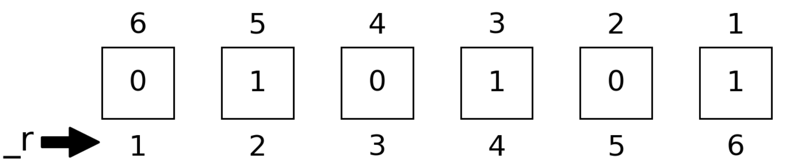
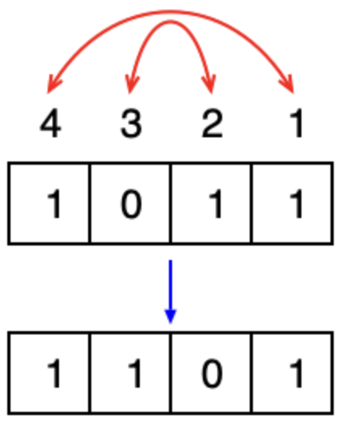
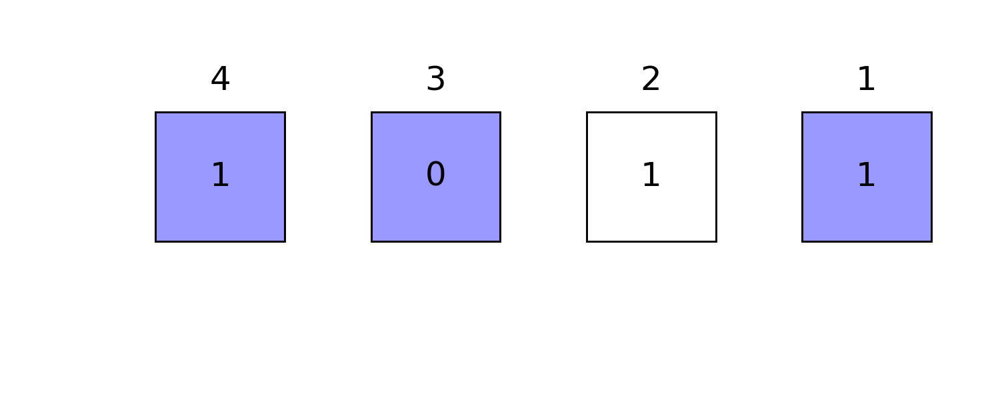

```@meta
CurrentModule = BitBasis
```

```@setup tutorial
using BitBasis
```

## Bit strings

This package provides a [string literal](https://docs.julialang.org/en/v1/manual/strings/#non-standard-string-literals) `@bit_str` to represent bit strings.
```@repl tutorial
b = bit"11100"
BitStr{5}(0b11100)  # convert from integer
bit_literal(0, 0, 1, 1, 1)  # from bit literals

[b...]  # convert to a vector of bits
b[2]  # indexing the 2nd bit
b.buf  # the storage type is `Int64` by default
typeof(b)
bit_length(b)  # the length of bit string
```
The type of `b` is `DitStr{2, 5, Int64}`, which means it is a bit string with 5 bits and the storage type is `Int64`. The `buf` field is the integer representation of the bit string.
Bit strings are represented as integers in the little-endian order, e.g. integer `28` represents the bit string `11100`.
```@raw html

```
The `bit_literal` function uses the array order to represent the bit string, which is different from the bit string literal, i.e. the leftmost bit is the least significant bit in the `bit_literal` function.

To represent bit strings with more than 64 bits, one can specify the storage type as `Int128` or `BigInt`.
```@repl tutorial
b = bit_literal(rand(BigInt[0, 1], 200)...)
typeof(b)
```

## Dit Strings
A nary basis is a generalization of a binary basis by changing the base from 2 to n.
. A dit string is a nary basis with a given base. The `@dit_str` string literal is used to represent dit strings.
For example, to represent a dit string with base 3, one can use the following code.
```@repl tutorial
d = dit"12210;3"
typeof(d)
```
The operations on dit strings are similar to those on bit strings.

## Concatenation and Repetition
To concatenate and repeat bit strings, one can use `join` and `repeat` functions.
```@repl tutorial
join([bit"101" for i in 1:10]...)  # concatenate bit strings
repeat(bit"101", 2)  # repeat bit string
```

## Readout
To readout bits, one can use [`readbit`](@ref) and [`baddrs`](@ref) functions.
```@raw html

```

```@repl tutorial
readbit(bit"11100", 2, 3)  # read the 2nd and 3rd bits as `x₃x₂`
baddrs(bit"11100")  # locations of one bits
```

A bit string can be read out as numbers in the following ways:
* [`bint`](@ref), the integer itself
* [`bint_r`](@ref), the integer with bits small-big end reflected.
* [`bfloat`](@ref), the float point number ``0.σ₁σ₂ \cdots σ_n``.
* [`bfloat_r`](@ref), the float point number ``0.σ_n \cdots σ₂σ₁``.
These functions are useful in quantum computing algorithms such as phase estimation and HHL.

```@raw html

```


```@repl tutorial
bint(bit"010101")
bint_r(bit"010101")
bfloat(bit"010101")
bfloat_r(bit"010101")
```


## Modification
To flip all bits, one can use the [`neg`](@ref) function.
```@repl tutorial
neg(bit"1011")  # flip all bits
```

To truncate bits, one can use the [`btruncate`](@ref) function.
```@repl tutorial
btruncate(bit"1011", 2)  # only keep the first 2 qubits
```

To change the order of bits, one can use [`breflect`](@ref) function.
```@raw html

```

```@repl tutorial
breflect(bit"1011")  # reflect little end and big end
```

## Masked Operations
One can use [`bmask`](@ref) to generate a mask for bit strings, and then use the mask to perform operations like [`allone`](@ref), [`anyone`](@ref), [`ismatch`](@ref), [`flip`](@ref), [`setbit`](@ref), [`swapbits`](@ref), etc.

```@repl tutorial
mask = bmask(BitStr{4, Int}, 1,3,4)  # mask bits 1, 3, 4
```
By coloring the masked positions in light blue, we have
```@raw html

```

```@repl tutorial
allone(bit"1011", mask)  # true if all masked positions are 1
anyone(bit"1011", mask)  # true if any masked positions is 1
ismatch(bit"1011", mask, bit"1001")  # true if masked part matches `1001`
flip(bit"1011", mask)  # flip masked positions: 1, 3, 4
setbit(bit"1011", bit"1100") # set masked positions to 1
swapbits(bit"1011", bit"1100")  # swap masked positions
```

## Hamming Distance

One can calculate the Hamming distance between two bit strings by [`bdistance`](@ref) function.
```@repl tutorial
bdistance(bit"11100", bit"10101")  # Hamming distance
```

## Hilbert Space

The [`basis`](@ref) function is used to iterate over the basis of a given number of bits.

```@repl tutorial
itr = basis(BitStr{4, Int})
collect(itr)
```

Iterating over basis in a controlled way plays an important role in quantum simulation. The [`itercontrol`](@ref) function is used to iterate over basis in a controlled way.
For example, if we want to iterate over the basis of 7 qubits, and we only want to iterate over the basis with the 1st, 3rd, 4th, and 7th qubits being 1, 0, 1, and 0, respectively, we can use the following code.
```@repl tutorial
for each in itercontrol(7, [1, 3, 4, 7], (1, 0, 1, 0))
    println(string(each, base=2, pad=7))
end
```


```@repl tutorial
v = onehot(bit"11100")  # the one hot vector representation of given bits
reorder(v, (3,2,1,5,4)) ≈ onehot(bit"11001")  # change the order of bits
invorder(v) ≈ onehot(bit"00111")  # change the order of bits
```

## BitArray Utilities
Utilities are provided to cast between integers and the `BitArray` type in Julia standard library.
* `bitarray(integers, nbits)`, transform integers to `BitArray`.
* `packabits(bitstring)`, transform `BitArray` to integers.

```@repl tutorial
barr = bitarray(28, 5)
packbits(barr)
barr_mult = bitarray([4, 5, 6], 5)
packbits(barr_mult)
```