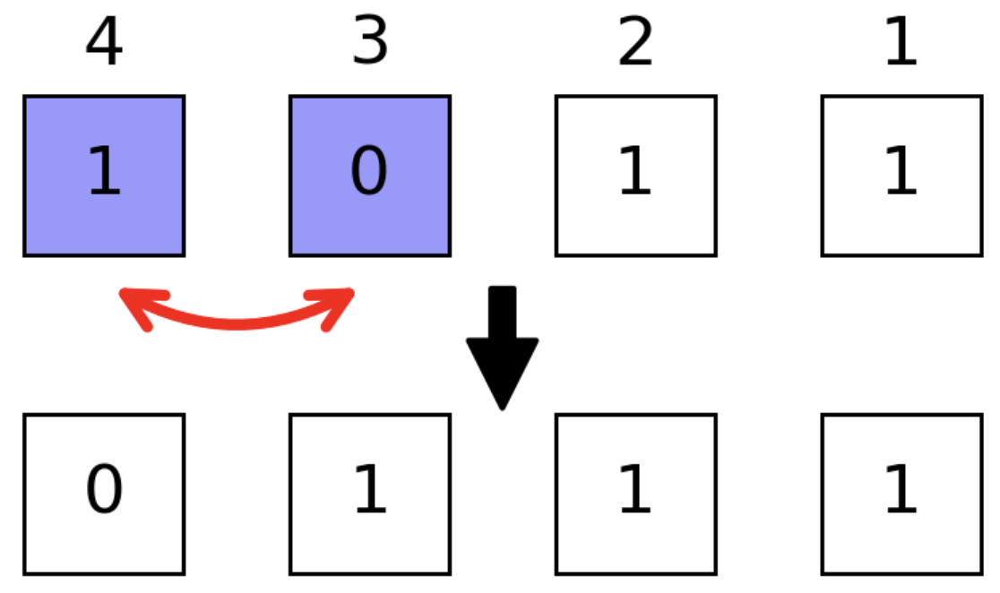

```@meta
CurrentModule = BitBasis
```

```@setup tutorial
using BitBasis
```

## Conventions

We use ``σ`` to represent a binary digit, its subtitle usually refers to the
position of a given binary digit inside a number (bit string).

In computing, bit numbering (or sometimes bit endianness) is the convention used to identify the bit positions in a binary number or a container of such a value. The bit number starts with zero and is incremented by one for each subsequent bit position. See also [Bit numbering](https://en.wikipedia.org/wiki/Bit_numbering)(**(Bit endianness)**).

There are two different representation orders of a bit string:

- **Least significant bit 0 bit  numbering**
- **Most significant bit 0 bit numbering**

### [**LSB 0 bit numbering**](@id array_order)

This follows the order of `BitArray` or other array representation of bits, e.g

For number `0b011101` (`29`)

```math
\sigma_1=1, \sigma_2=0, \sigma_3=1, \sigma_4=1, \sigma_5=1, \sigma_6=0
```

See also [LSB 0 bit numbering](https://en.wikipedia.org/wiki/Bit_numbering#LSB_0_bit_numbering)

### [**MSB 0 bit numbering**](@id literal_order)

This follows the order of binary literal `0bxxxx`, e.g

For number `0b011101` (`29`)

```math
\sigma_1=0, \sigma_2=1, \sigma_3=1, \sigma_4=1, \sigma_5=0, \sigma_6=1
```

See also [MSB 0 bit numbering](https://en.wikipedia.org/wiki/Bit_numbering#MSB_0_bit_numbering).

## Integer Representations

We use an `Int` type to store bit-wise (spin) configurations, e.g. `0b011101` (`29`) represents the configuration

```math
\sigma_1=1, \sigma_2=0, \sigma_3=1, \sigma_4=1, \sigma_5=1, \sigma_6=0
```

so we annotate the configurations ``\vec σ`` with integer $b$ by ``b = \sum\limits_i 2^{i-1}σ_i``.

e.g. we can use a number `28` to represent bit configuration `0b11100`

```@repl tutorial
bdistance(0b11100, 0b10101) == 2  # Hamming distance
bit_length(0b11100) == 5
```

In `BitBasis`, we also provide a more readable way to define these kind of objects, which is called [the bit string literal](@ref bit_literal), most of the integer operations and `BitBasis` functions are overloaded for [the bit string literal](@ref bit_literal).

We can switch between binary and digital representations with
* `bitarray(integers, nbits)`, transform integers to bistrings of type `BitArray`.
* `packabits(bitstring)`, transform bitstrings to integers.
* `baddrs(integer)`, get the locations of nonzero qubits.

```@repl tutorial
bitarray(4, 5)
bitarray([4, 5, 6], 5)
packbits([1, 1, 0])
bitarray([4, 5, 6], 5) |> packbits;
```

A curried version of the above function is also provided. See also [`bitarray`](@ref).

## [Bit String Literal](@id bit_literal)
bit strings are literals for bits, it provides better view on binary basis.
you could use [`@bit_str`](@ref), which looks like the following

```@repl tutorial
bit"101" * 2
bcat(bit"101" for i in 1:10)
repeat(bit"101", 2)
bit"1101"[2]
```

to define a bit string with length. `bit"10101"` is equivalent to `0b10101` on both performance and functionality but it store the length of given bits statically.
The bit string literal offers a more readable syntax for these kind of objects.

Besides bit literal, you can convert a string or an integer to bit literal by [`bit`](@ref), e.g

```@repl tutorial
BitStr{5}(0b00101)
```

## Bit Manipulations
#### [`readbit`](@ref) and [`baddrs`](@ref)


```@repl tutorial
readbit(0b11100, 2, 3) == 0b10  # read the 2nd and 3rd bits as `x₃x₂`
baddrs(0b11100) == [3,4,5]  # locations of one bits
```

#### [`bmask`](@ref)
Masking technic provides faster binary operations, to generate a mask with specific position masked, e.g. we want to mask qubits `1, 3, 4`

```@repl tutorial
mask = bmask(UInt8, 1,3,4)
bit(mask; len=4)
```

#### [`allone`](@ref) and [`anyone`](@ref)
with this mask (masked positions are colored light blue), we have


```@repl tutorial
allone(0b1011, mask) == false # true if all masked positions are 1
anyone(0b1011, mask) == true # true if any masked positions is 1
```

#### [`ismatch`](@ref)


```@repl tutorial
ismatch(0b1011, mask, 0b1001) == true  # true if masked part matches `0b1001`
```


#### [`flip`](@ref)


```@repl tutorial
bit(flip(0b1011, mask); len=4)  # flip masked positions
```

#### [`setbit`](@ref)


```@repl tutorial
setbit(0b1011, 0b1100) == 0b1111 # set masked positions 1
```

#### [`swapbits`](@ref)


```@repl tutorial
swapbits(0b1011, 0b1100) == 0b0111  # swap masked positions
```

#### [`neg`](@ref)

```@repl tutorial
neg(0b1011, 2) == 0b1000
```

#### [`btruncate`](@ref) and [`breflect`](@ref)


```@repl tutorial
btruncate(0b1011, 2) == 0b0011  # only the first two qubits are retained
```

#### [`breflect`](@ref)


```@repl tutorial
breflect(4, 0b1011) == 0b1101  # reflect little end and big end
```


For more detailed bitwise operations, see manual page [BitBasis](@ref BitBasis).

## Number Readouts
In phase estimation and HHL algorithms, one need to read out qubits as integer or float point numbers.
A register can be read out in different ways, like
* [`bint`](@ref), the integer itself
* [`bint_r`](@ref), the integer with bits small-big end reflected.
* [`bfloat`](@ref), the float point number ``0.σ₁σ₂ \cdots σ_n``.
* [`bfloat_r`](@ref), the float point number ``0.σ_n \cdots σ₂σ₁``.


```@repl tutorial
bint(0b010101)
bint_r(0b010101, nbits=6)
bfloat(0b010101)
bfloat_r(0b010101, nbits=6);
```

Notice the functions with `_r` as postfix always require `nbits` as an additional input parameter to help reading, which is regarded as less natural way of expressing numbers.

## Iterating over Bases
Counting from `0` is very natural way of iterating quantum registers, very pity for `Julia`


```@repl tutorial
itr = basis(4)
collect(itr)
```


[`itercontrol`](@ref) is a complicated API, but it plays an fundamental role in high performance quantum simulation of `Yao`. It is used for iterating over basis in controlled way, its interface looks like

```@repl tutorial
for each in itercontrol(7, [1, 3, 4, 7], (1, 0, 1, 0))
    println(string(each, base=2, pad=7))
end
```

## Reordering Basis
We store the wave function as $v[b+1] := \langle b|\psi\rangle$.
We are able to reorder the basis as


```@repl tutorial
v = onehot(5, 0b11100)  # the one hot vector representation of given bits
reorder(v, (3,2,1,5,4)) ≈ onehot(5, 0b11001)
invorder(v) ≈ onehot(5, 0b00111)  # breflect for each basis
```
